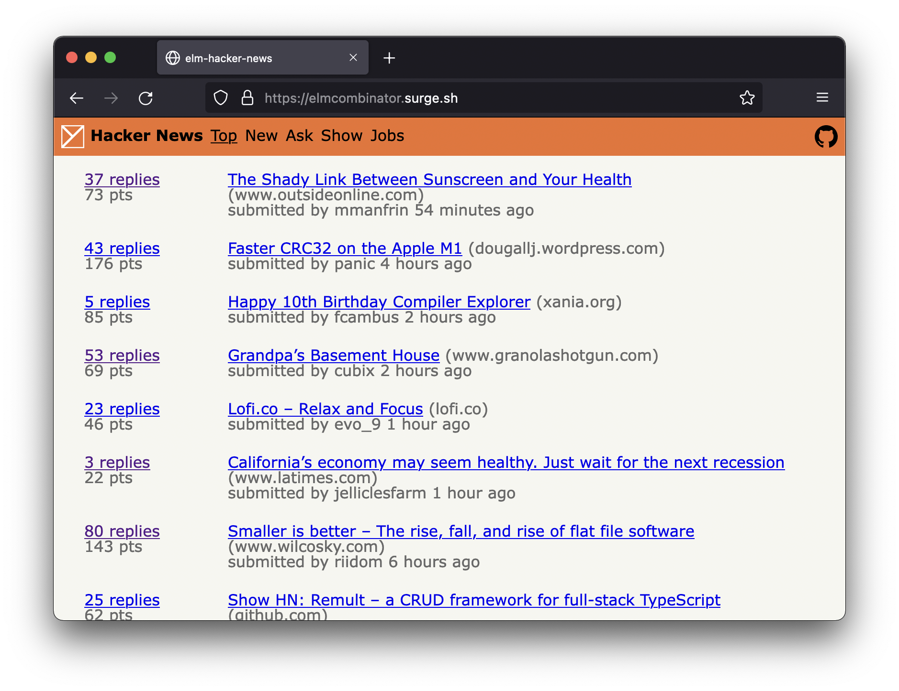
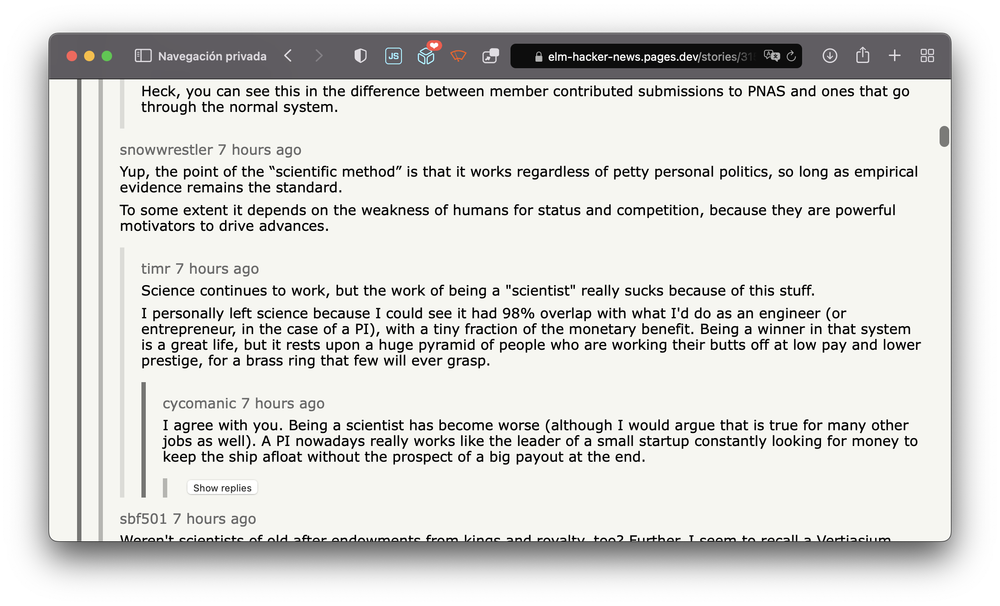

# elm-hacker-news

**Online demo**: <https://elm-hacker-news.pages.dev/>

A Hacker News client (SPA) implemented with [Elm](https://elm-lang.org/).

Uses HN's offical API: <https://github.com/HackerNews/API>




## Technical notes

### Request spam

HN's API is interesting to work with because it only gives you a list of IDs
that represent immediate-child comments.

```json
{
    "type": "comment",
    "by": "norvig",
    "id": 2921983,
    "kids": [2922097, 2922429, 2924562, 2922709, 2922573, 2922140, 2922141],
    "text": "Aw shucks, guys ... you make me blush with your compliments.<p>Tell you what, Ill make a deal: I'll keep writing if you keep reading. K?"
}
```

This means that you must recursively request each child ID to build the complete comment tree, and this entails making hundreds of
requests for large threads.

I notice that most HN clients in the wild use alternative APIs (e.g. https://hnpwa.com) that let you, sensibly, make a single request and you get back a single response that already includes one big comment tree.

```json
{
    "by": "foo",
    "id": 1,
    "text": "hello",
    "kids": [
        {
            "by": "bar",
            "id": 2,
            "text": "world",
            "kids": [
                {
                    "by": "qux",
                    "id": 3,
                    "text": "goodbye",
                    "kids": []
                }
            ]
        }
    ]
}
```

That would be really nice, but I'm sticking with the official API. For one, it's an interesting challenge.

Currently, my approach is the most naive: Every time I receive a comment response, I immediately send off a new request for each `comment.kids`.

However, this has major downsides:

-   This ends up being a breadth-first fetch order as each level of comments is fetched. You'd probably want a depth-first fetch order where comments at the top of the page are loaded before comments at the bottom.
-   Requests cannot be throttled nor canceled. Every time one comment response comes back, N requests are put in flight. Especially noticable on a large story with a slow/throttled connection, navigating away from the page while comments are loading is slow as requests are still in flight. Requests relevant to the page you are trying to navigate away from will hold up requests for the page you want to load!

I haven't spent any time considering better solutions, yet.

### Service worker

Sheepishly, I've never written a service worker for client-side apps, so I scrapped one together for this project (`service-worker.js`) to intercept requests to HN's API.

Right now all it does is serve HN API requests from a cache for the sole purpose of making the client snappier for the user. Cached responses are returned immediately, but a 1:1 request is still made to HN's API to update the cache in the background.

This feels good on fast connections, but the background requests compete with foreground requests on slow connections.

I'd like to develop this more.
